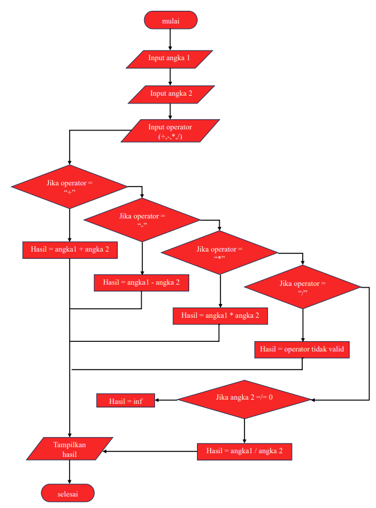

# labpy02-den
Nama : Den Fahmi Satria 

Kelas : TI.24.A.5 
 
Nim : 312410523 

Mata Kuliah : Bahasa pemograman 
 
## Judul: pemesanan tiket bioskop
### Flowchart

- **Mulai**: Proses dimulai dengan langkah ini
- **menginisiasi harga tiket:**
  masukkan untuk tiket reguler = Rp.50000
  dan untuk Vip = Rp.100000
  diskon bagi yang member adalah 20%
  maka tentukan harga untuk tiket reguler dan tiket Vip, serta diskon untuk member

- **input tipe tiket:** pembeli diminta untuk memasukkan tipe tiket yang ingin dibeli, apakah Vip atau Reguler
- **input status member:** pembeli diminta memasukkan status keanggotaan mereka, apakah memiliki kartu member, jika iya "iya" dan jika tidak "tidak"
- **validasi tipe tiket** Program memeriksa apakah tipe tiket yang diinput adalah "Reguler" atau "VIP": 

  Jika tipe tiket adalah "reguler", lanjutkan ke langkah berikutnya dengan harga tiket diatur ke Rp50.000. 

  Jika tipe tiket adalah "VIP", lanjutkan ke langkah berikutnya dengan harga tiket diatur ke Rp100.000. 

  Jika tipe tiket bukan "reguler" atau "VIP", anggap sebagai input yang tidak valid dan minta pengguna untuk memasukkan tipe tiket yang benar. 

- **Periksa Apakah Harga Tidak Nol:**
Program memeriksa apakah harga tiket sudah diatur (tidak nol):

Jika harga sudah diatur, lanjutkan ke langkah berikutnya.

Jika harga belum diatur (nol), kembali ke input tipe tiket.

- **Cek Status Member dan Hitung Diskon:**

Program memeriksa apakah pengguna memiliki kartu member:

Jika pengguna memiliki kartu member ("ya"), harga akhir dihitung dengan memberikan diskon 20%.

Jika pengguna tidak memiliki kartu member ("tidak"), harga akhir tetap sama dengan harga tiket tanpa diskon.

- **Tampilkan Harga Akhir:** Program menampilkan total harga tiket yang harus dibayar oleh pengguna.
- **Selesai:** Proses selesai

### program python
program python akan di tampilkan seperti ini dari flowchart yang ada di atas

### eksekusi dari Python yang ada di atas
dan ini adalah eksekusi yang akan di tampilkan jika kalian menginputkan ya atau tidak

#**judul:membuat fungsi aritmatika dasar**

